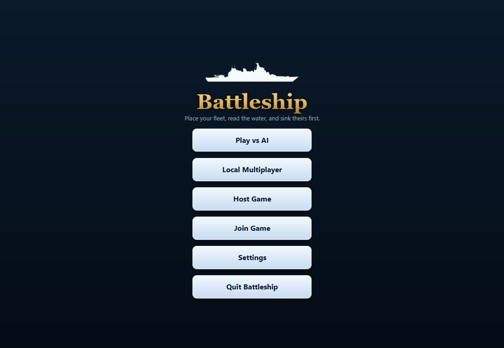
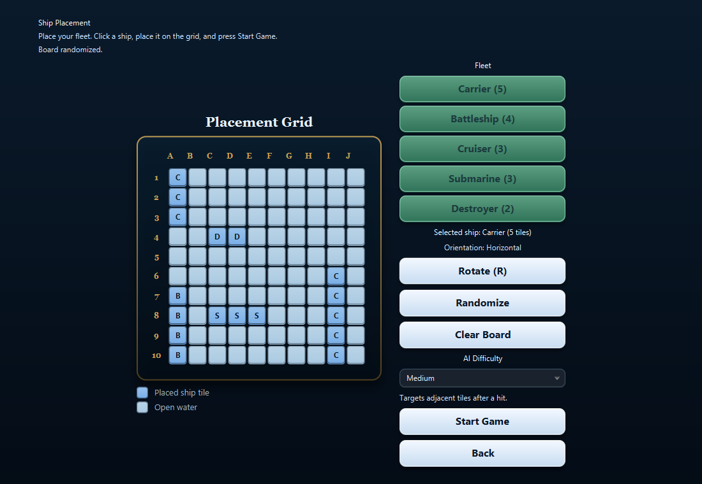
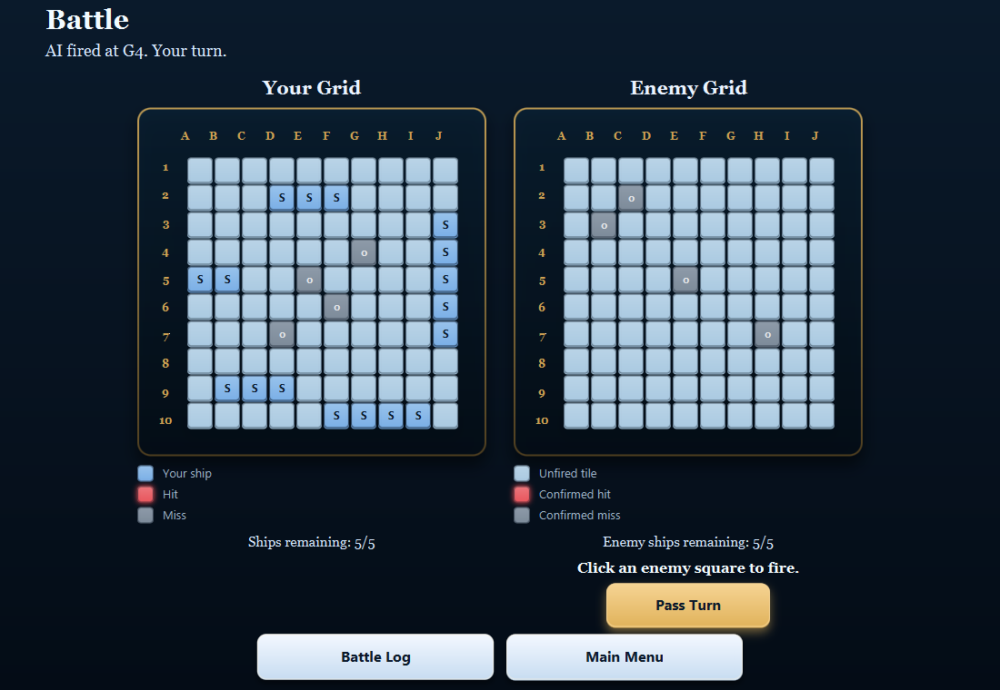
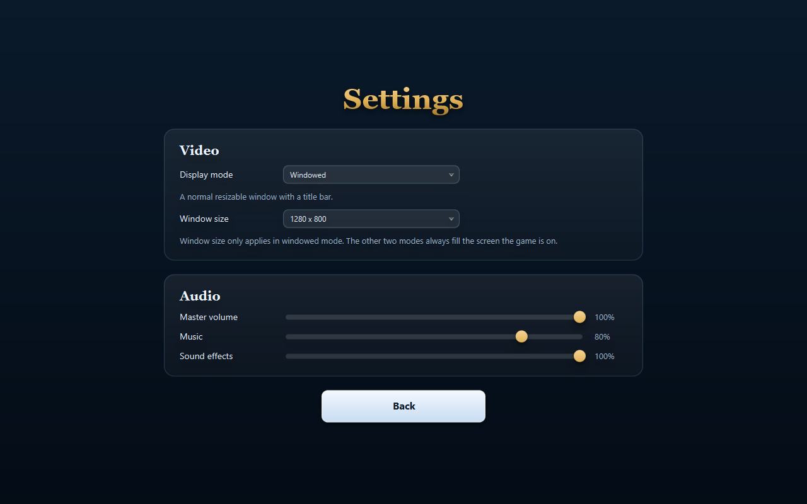
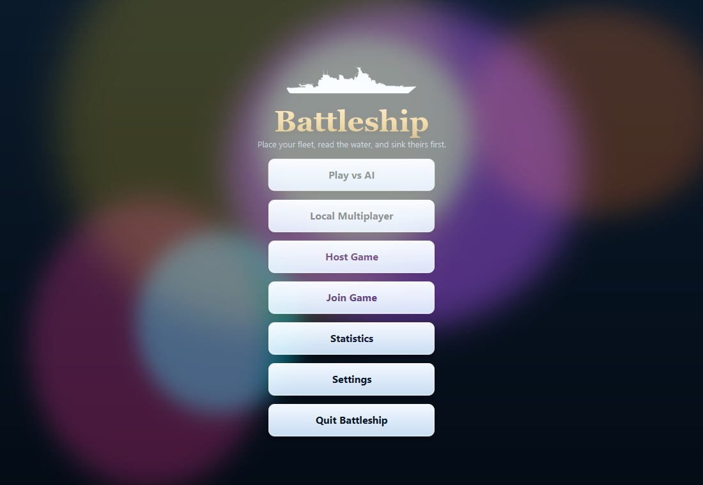

# BattleshipJava

A desktop Battleship game written in Java and JavaFX. Place a fleet of five ships, then
take turns firing at a ten-by-ten grid until one side has nothing left afloat. You can play
against a computer opponent across six difficulty levels, hand the same machine back and
forth with a friend, or play over your local network with a six-character join code.

[](https://github.com/SamuelArther/BattleshipJava/actions/workflows/build.yml)

**[⬇ Download the latest release](https://github.com/SamuelArther/BattleshipJava/releases/latest)**
— Windows, macOS and Linux builds, each with Java already bundled inside. You do not need to
install Java to play.

---



## Contents

- [Download and install](#download-and-install)
- [How to play](#how-to-play)
- [Game modes](#game-modes)
- [Difficulty levels](#difficulty-levels)
- [Playing over a local network](#playing-over-a-local-network)
- [Terms of service](#terms-of-service)
- [Statistics](#statistics)
- [Settings](#settings)
- [Controls](#controls)
- [The party](#the-party)
- [Building from source](#building-from-source)
- [How the project is laid out](#how-the-project-is-laid-out)
- [Licence](#licence)

---

## Download and install

Every release on the [releases page](https://github.com/SamuelArther/BattleshipJava/releases/latest)
carries three archives, one per platform. Each one is a self-contained application with its own
private Java runtime inside it, so there is no JDK to install, no `JAVA_HOME` to set, and no
version of Java on your machine that it can conflict with. The download is large for a Battleship
game — a little over a hundred megabytes — because that bundled runtime is the price of not
making you install anything.

Pick the archive that matches your machine:

| Your system | File to download |
| --- | --- |
| Windows 10 or 11, 64-bit | `BattleshipJava-<version>-windows.zip` |
| macOS, Apple Silicon (M1 and later) | `BattleshipJava-<version>-macos-apple-silicon.zip` |
| Linux, 64-bit | `BattleshipJava-<version>-linux.tar.gz` |

### Windows

1. Download `BattleshipJava-<version>-windows.zip`.
2. Right-click the file and choose **Extract All**. Extract it somewhere you intend to keep it,
   such as `C:\Games\Battleship` — the game runs from wherever you unzip it and does not install
   itself anywhere else.
3. Open the extracted `Battleship` folder and run **`Battleship.exe`**.

The first time you run it, Windows SmartScreen will most likely show a blue box saying
"Windows protected your PC". This happens because the release is not code-signed, which requires
a paid certificate. Click **More info**, then **Run anyway**. If you would rather not, you can
[build the game yourself from source](#building-from-source) instead.

To make it easier to launch later, right-click `Battleship.exe` and choose
**Show more options → Send to → Desktop (create shortcut)**.

### macOS (Apple Silicon)

1. Download `BattleshipJava-<version>-macos-apple-silicon.zip` and double-click it to unpack
   `Battleship.app`.
2. Drag `Battleship.app` into your **Applications** folder.
3. The app is not notarised by Apple, so double-clicking it the normal way will be blocked.
   The first time only, **right-click (or Control-click) the app and choose Open**, then confirm
   with **Open** in the dialog. After that it launches normally.

If macOS refuses to open it at all and reports the app is damaged, that is the quarantine flag
rather than a real problem with the download. Clear it from Terminal:

```bash
xattr -dr com.apple.quarantine /Applications/Battleship.app
```

There is no Intel build. On an Intel Mac, build from source.

### Linux

1. Download `BattleshipJava-<version>-linux.tar.gz`.
2. Unpack it and run the launcher:

```bash
tar -xzf BattleshipJava-*-linux.tar.gz
cd Battleship
./bin/Battleship
```

The bundled runtime covers Java and JavaFX, but JavaFX still renders through your system's
graphics and audio libraries. On a minimal or headless-leaning install you may need GTK and
GStreamer present. On Debian or Ubuntu:

```bash
sudo apt install libgtk-3-0 gstreamer1.0-plugins-base gstreamer1.0-plugins-good
```

Without GStreamer the game still runs; it simply plays no sound.

---

## How to play



You start on the placement screen with five ships to position on your grid:

| Ship | Length |
| --- | --- |
| Carrier | 5 |
| Battleship | 4 |
| Cruiser | 3 |
| Submarine | 3 |
| Destroyer | 2 |

Select a ship from the fleet list, press **R** to rotate it between horizontal and vertical, and
click a square on your grid to drop it there. **Randomize** lays the whole fleet out for you, and
**Clear Board** starts the placement again.

There is one placement rule that catches people out, so it is worth stating plainly:
**ships may not touch each other, not even at a corner.** Every ship needs at least one square of
open water around it on all sides, diagonals included. This is not decoration — it is the rule the
computer opponent leans on, because the moment a ship sinks, every square touching it is known to
be empty water.

Once all five ships are placed, start the game.



Your grid is on the left and your opponent's is on the right. Click any square on the enemy grid
to fire at it. A red **X** is a hit, a grey **o** is a miss, and the status line above tells you
what happened and whose turn it is. When you sink something, the game names the ship you sank.
Play alternates until one fleet is completely destroyed.

---

## Game modes

**Play vs AI** — a single-player game against the computer, at a difficulty you pick on the
placement screen, from Easy up to All of the US Armed Forces.

**Local Multiplayer** — two players sharing one machine. Each player places their fleet in turn,
and between turns the game covers the screen with a hand-off prompt so the player waiting cannot
see the other player's board.

**Host Game / Join Game** — two machines on the same network. See
[playing over a local network](#playing-over-a-local-network) below.

---

## Difficulty levels

The six levels are genuinely different opponents rather than the same opponent with the numbers
turned up. The figures below are the average number of shots each one needs to clear a full board,
measured over two hundred randomised games by the project's own test suite. A hundred shots would
mean firing at every square on the grid.

| Level | Average shots | How it plays |
| --- | --- | --- |
| **Easy** | 87 | Fires at random. It never follows up on a hit, so it only wins by exhaustion. |
| **Medium** | 58 | Once it hits something, it works around the neighbouring squares until the ship goes down. |
| **Hard** | 51 | After two hits it works out which way the ship is lying and drives along that line, rather than probing blindly around each hit. |
| **Nightmare** | 45 | Hunts on a checkerboard. The smallest ship is two squares long, so it cannot hide entirely on one colour, which means half the board can be skipped while hunting. |
| **US Navy** | 42 | Rebuilds a probability map every single turn, counting how many ways each ship still afloat could be lying across each square, and fires at the square with the most possible placements. |
| **All of the US Armed Forces** | 38 | Every branch at once. Sweeps on the tightest lattice the shortest surviving ship cannot slip through, counts every placement still possible, and weights the ones explaining a confirmed hit far above the rest, so a wounded ship is finished rather than merely favoured. It feels like it is cheating. It is not: it never sees your board, and the test suite plays it the same way the game does. |

Every level, Easy included, understands that the water around a sunk ship must be empty and will
not waste shots there. None of them can see where your ships are; they only know the same hits,
misses and sunk ships you would see from the other side of the board.

---

## Playing over a local network

Both machines need to be on the same network — the same Wi-Fi, or the same wired LAN. This is not
an internet mode; there is no server in the middle and no port forwarding involved.

**On the host machine:** choose **Host Game**. The game picks a six-character join code and shows
it on screen. The alphabet leaves out characters that look alike, so there is no `0` against `O`
or `1` against `I` to misread when you say it out loud.

**On the joining machine:** choose **Join Game** and type in that code. The host announces itself
over UDP on port 50506 and the joining game listens for it, so the code is all you need — no IP
address to find or type.

Both players then place their fleets and press Ready. The game begins when both sides are ready,
and the host takes the first turn. Gameplay itself runs over TCP on port 50505.

If joining fails, the usual causes are that the two machines are on different networks — a phone
hotspot and the house Wi-Fi, or a guest network that isolates clients from each other — or that a
firewall is blocking the game. On Windows, allow Battleship through Windows Defender Firewall for
private networks when it first asks.

---

## Terms of service

The first time you launch the game it asks you to agree to its terms of service. They are a
joke, they are fourteen clauses long, and they are shorter than the ones you agreed to this
morning without reading. The I Agree button stays disabled until you have actually scrolled to
the bottom of them, which is more honesty than the genuine article usually manages.

One clause is not a joke. Clause 2 is real: ships genuinely may not touch each other.

Agreement is recorded by version number, so the terms are only shown again if they change.
Declining closes the game, which is the only thing a "you must agree" screen can honestly do.

---

## Statistics

**Statistics** on the main menu keeps a record of how you actually play: games, wins, losses,
win rate, total shots fired, overall accuracy, your current winning streak and your best one,
and the hardest difficulty you have ever beaten. Underneath is a row per difficulty showing how
many games you have played at that level, how many you won, and your best game there, meaning
the fewest shots you have ever needed to clear the board. Firing at every square would take a
hundred, so anything under fifty is a good game.

Only single-player games are counted, deliberately. A hot-seat game has no result that belongs
to one person, and a network game is decided as much by your opponent as by you, so neither
would tell you anything about how well you play. The record is kept in
`~/.battleshipjava/statistics.properties` and there is a reset button, which asks twice.

---

## Settings



**Settings** on the main menu covers how the game looks and sounds. Everything applies the moment
you change it, and is remembered for next time in
`~/.battleshipjava/settings.properties` (on Windows, `C:\Users\<you>\.battleshipjava\`).

**Display mode**

- *Windowed* — an ordinary resizable window with a title bar.
- *Borderless fullscreen* — fills the screen with no border and no title bar, and leaves
  Alt-Tab instant, because the game is still just a window as far as the system is concerned.
- *Exclusive fullscreen* — true fullscreen. **F11** or **Esc** leaves it.

**Window size** — five sizes from 1100×760 up to 1920×1080. This applies to windowed mode only;
the two fullscreen modes always fill the display. 1100×760 is the smallest size the game will go
to, and the whole board fits at that size.

**Audio** — separate sliders for master volume, music and sound effects. The music slider retunes
whatever is playing as you drag it, and the sound effects slider plays a sample so you can hear
the level you are setting.

---

## Controls

| Key or action | What it does |
| --- | --- |
| Click an enemy square | Fire at it |
| Click your own grid (setup) | Place the selected ship |
| **R** | Rotate the selected ship |
| **F11** | Toggle fullscreen |
| **Esc** | Leave fullscreen |
| **↑ ↑ ↓ ↓ ← → ← → B A** | Throw a party. Enter it again to end one early. |

---

## The party

There is a code. Enter it anywhere in the game:

**↑ ↑ ↓ ↓ ← → ← → B A**

Ten keys in a fixed order, which is the point: nothing about ordinary play walks into it by
accident. A wrong key resets the run, so take your time.

The lights come up over whatever screen you are on, the music starts, and when the track runs
out the lights fade and everything goes back to exactly how it was, including the menu music if
that was playing when you started. The overlay never takes the mouse, so a game underneath stays
playable the entire time. Enter the code again to send everyone home early.



---

## Building from source

You need **JDK 21 or newer**. Nothing else — the build fetches JavaFX itself, so there is no SDK
to download and no path to configure.

```bash
git clone https://github.com/SamuelArther/BattleshipJava.git
cd BattleshipJava

./gradlew run     # compile and launch the game
./gradlew test    # run the test suite
./gradlew jar     # build a runnable jar in build/libs
```

On Windows use `gradlew.bat` in place of `./gradlew`.

To build the same self-contained application the releases ship, with a bundled Java runtime for
whichever platform you are on:

```bash
./gradlew packageApp
```

The result lands in `build/jpackage/` — `Battleship/` on Windows and Linux, `Battleship.app` on
macOS. This step uses `jpackage` from your JDK, so the platform you build on is the platform you
get.

To regenerate the screenshots in this README from the real interface:

```bash
./gradlew screenshots
```

---

## How the project is laid out

```
src/
  Main.java              application entry point, window and display handling
  ai/                    the five difficulty levels and the shot selection behind them
  audio/                 music and sound effect playback
  game/                  board, ships, placement rules, attack results — no JavaFX in here
  network/               LAN discovery by join code, and the game session over TCP
  settings/              video and audio preferences, saved between sessions
  ui/                    the screens, and the shared widgets they are built from
test/                    JUnit tests for the board rules and the AI
resources/               images, audio, and theme.css
packaging/               application icons for each platform
```

Two boundaries are worth knowing about if you plan to change anything. The `game` package has no
JavaFX in it at all, which is what makes the rules and the AI straightforward to test without a
display. And the appearance of every screen lives in `resources/theme.css` rather than being
scattered through the scene classes, so the look can be changed in one file.

---

## Licence

Released under [CC0 1.0 Universal](LICENSE). Public domain — do what you like with it.
